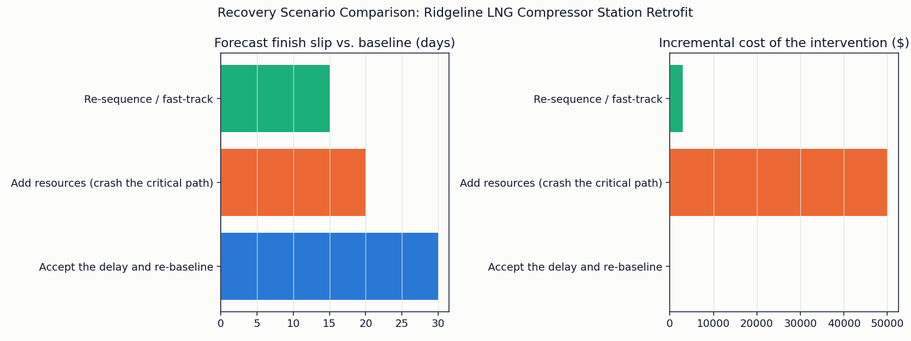

# Recovery Scenario Planner

 [](https://codecov.io/gh/alexc-hue/recovery-scenario-planner) [](LICENSE) 

The other five tools in this toolkit report a status. None of them answer
the next question a sponsor actually asks: "so what do we do about it."
This one does. Point it at a programme's current SPI/CPI, critical-path
delay, and top risk exposure, and it models three concrete recovery
options, add resources, re-sequence, accept the delay, against the same
CPM/EVM math the rest of the toolkit already uses, then ranks them with a
stated, one-sentence-per-option rationale instead of a gut call.

Part of a small project-controls toolkit:
[project-controls-dashboard](https://github.com/alexc-hue/project-controls-dashboard),
[schedule-health-analyzer](https://github.com/alexc-hue/schedule-health-analyzer),
[change-control-register](https://github.com/alexc-hue/change-control-register),
[risk-trend-tracker](https://github.com/alexc-hue/risk-trend-tracker),
[project-controls-reporting-engine](https://github.com/alexc-hue/project-controls-reporting-engine),
**recovery-scenario-planner** (this repo).



## Problem

A status report, even an integrated one, stops at "here's what's wrong."
It doesn't tell a sponsor what their actual choices are, what each one
costs, how much schedule it buys back, or what it does to risk exposure.
That gap gets filled by a gut call in a status meeting, usually the loudest
or most familiar option, rather than a comparison anyone actually ran the
numbers on.

## Approach

- Run the vendored CPM and EVM engines (unchanged, see Implementation)
  against the Ridgeline programme's current status to get a starting
  point: SPI/CPI, the current critical-path delay, and portfolio risk
  exposure.
- Apply three canned, named, parametric interventions to that starting
  point, each a short, stated rule, not a simulation or a forecast:
  - **Add resources (crash the critical path).** Cut a stated 30% off the
    remaining duration of the still-open critical activities, at a stated
    $5,000 per day saved, and rerun the network. This is deliberately the
    more expensive, less clever option. It is **not** the lever actually
    used in the real recovery this tool is modeled on.
  - **Re-sequence / fast-track.** Convert one stated sequential pair
    (pre-commissioning checks into functional testing) from finish-to-start
    to running in parallel from the same upstream gate, and rerun the
    network. No predecessor is deleted from the activities that actually
    gate that pair, only the pair's own internal ordering is re-timed. This
    **is** the lever actually used in the real recovery, "sequential phases
    are a scheduling assumption, not a physical law," and it costs a stated
    $3,000 in coordination overhead against a stated exposure uplift on the
    two risks that already flag a compressed commissioning window.
  - **Accept the delay and re-baseline.** No schedule change. Recompute the
    revised EAC and risk exposure against the current forecast finish as
    the honest do-nothing comparison point.
- Rank the three with a stated decision-rule table (`src/recommend.py`):
  a 0-100 fit score built from three named, capped components, Recovery,
  Cost, Risk, plus one additional stated rule that penalizes accepting the
  delay outright when SPI is already below the common EVM "amber"
  threshold. Every component is explainable in one sentence, no opaque
  scoring, no ML.

## Implementation

Built in Python, and deliberately reuses rather than reimplements: the CPM
engine (`engines/schedule/cpm.py`), the schedule health comparison
(`engines/schedule/metrics.py`), the EVM functions
(`engines/dashboard/metrics.py`), and the risk trend scoring
(`engines/risk/metrics.py`) are the exact modules already published in
schedule-health-analyzer, project-controls-dashboard, and risk-trend-tracker,
vendored unchanged, same pattern project-controls-reporting-engine already
uses. No new CPM, EVM, or risk-scoring logic exists anywhere in this repo.
The only new code is `src/interventions.py` (the three canned scenarios),
`src/recommend.py` (the decision-rule table), `planner.py`
(orchestration), and a small chart-style/formatting layer shared with the
other five repos. The sample data is the same fictional Ridgeline LNG
Compressor Station Retrofit programme project-controls-reporting-engine
already uses, reused unchanged so both repos describe the same story from
different angles.

## Result

```
====================================================================
RECOVERY SCENARIO COMPARISON
Ridgeline LNG Compressor Station Retrofit, as of 2026-08-01
====================================================================

Baseline finish:  2026-08-03
Cost performance to date: SPI 0.85  CPI 0.91  EAC $2,637,363  VAC -$237,363

Option                                    Finish       Days recov.  Cost impact   Revised EAC   Risk exposure
------------------------------------------------------------------------------------------------------------
Accept the delay and re-baseline          2026-09-02      +0                $0    $2,637,363         38.0
Add resources (crash the critical path)   2026-08-23     +10           $50,000    $2,687,363         38.0
Re-sequence / fast-track                  2026-08-18     +15            $3,000    $2,640,363         43.5

====================================================================
RECOVERY OPTION RANKING
Current status: SPI 0.85  CPI 0.91  critical-path delay +30d  portfolio risk exposure 38
====================================================================

1. Re-sequence / fast-track  -  Fit score 56.5/100
   Recovery 20.0/40   Cost 21.0/30   Risk 15.5/30
   Recovers 15 days by running CM1->CM2 in parallel instead of back-to-back, for a stated $3,000 coordination cost, far cheaper than crashing, but raises exposure on the two risks that already flag a compressed commissioning window (R03/R06) by a stated 25%.

2. Accept the delay and re-baseline  -  Fit score 45.0/100
   Recovery 0.0/40   Cost 30.0/30   Risk 30.0/30   (SPI penalty applied)
   No schedule change: forecast finish stays 2026-09-02, 30 days late against baseline, at zero incremental cost and no added risk. This is the option the other two get measured against, not a lever.

3. Add resources (crash the critical path)  -  Fit score 43.3/100
   Recovery 13.3/40   Cost 0.0/30   Risk 30.0/30
   Buys back 10 days by paying for extra crew/shift capacity on the still-open critical activities, a stated 30% cut to their remaining duration at $5,000/day saved, $50,000 total. The most expensive of the three options, and not the lever actually used in the real recovery this tool is modeled on.

RECOMMENDATION: Re-sequence / fast-track (fit score 56.5/100).
```

Fast-tracking recovers half the delay (15 of 30 days) at 6% of crashing's
cost ($3,000 against $50,000) and clearly outranks it, the same trade-off
behind the real recovery this tool is modeled on: re-sequencing beat
crashing because the constraint was sequencing logic, not capacity.

## Screenshots

**Before/after comparison** - forecast finish slip and incremental cost,
side by side for all three options.


## Limitations

- Fast-tracking is modeled as one stated pair converting from
  finish-to-start to a full parallel start. A real fast-track decision is
  usually a partial overlap (start-to-start plus a lag), not always a full
  parallel run; this tool doesn't model partial lags, only whole-pair
  re-sequencing, deliberately, to keep the CPM engine itself completely
  unmodified.
- The risk exposure uplift from fast-tracking and the coordination/crash
  costs are stated, fixed parameters (25% uplift, $5,000/day, $3,000 flat),
  not derived from the risk register or a cost model. A real recovery
  decision would need those numbers from the PMO and commercial function,
  not a flat assumption.
- The fit score's three components and the SPI penalty rule are one
  reasonable, explainable weighting, not the only defensible one. Change
  the ceilings or the risk tolerance band and a different option can win;
  the point is that every input to that outcome is visible and stated, not
  that this is the single correct answer.
- No Monte Carlo or probabilistic simulation, no resource leveling, no
  multi-scenario what-if UI, and no ML-based recommendation, on purpose.
  This models named, parametric choices a PM would actually consider, not
  a forecast of unknown ones.
- Descope was considered as a fourth intervention and left out: none of
  the programme's remaining commissioning activities in this dataset is a
  genuine low-value candidate to cut, and fabricating one just to fill a
  fourth slot would have been less honest than leaving it out.

## What I learned

The interesting design problem wasn't the math, all of it already existed
in the other four repos, it was making the fast-track intervention honest
without touching the vendored CPM engine at all. The clean way to do that
turned out to be re-timing the predecessor graph itself (one pair's
finish-to-start link becomes a shared-start link) and letting the same
unmodified forward/backward pass recompute the consequences, rather than
writing a second, parallel scheduling algorithm just for this repo. That
also made the "no hard predecessor removed" constraint easy to keep
honest: the only edge that changes is the one stated pair being
fast-tracked, everything else in the network is untouched.

## Run it

```bash
pip install -r requirements.txt
python planner.py
```

Swap in your own `data/activities.csv`, `data/cost_schedule_timeseries.csv`,
and `data/risk_snapshots.csv` (same schemas as schedule-health-analyzer,
project-controls-dashboard, and risk-trend-tracker) and adjust the
parameters at the top of `src/interventions.py` (which activities to
fast-track, crash percentage, cost-per-day, risk uplift) to point this at a
real recovery decision. The `BAC`/`PROJECT_START`/`STATUS_DATE` constants
near the top of `planner.py` are this fictional programme's assumptions
too, not read from the CSVs, so update those by hand as well.
